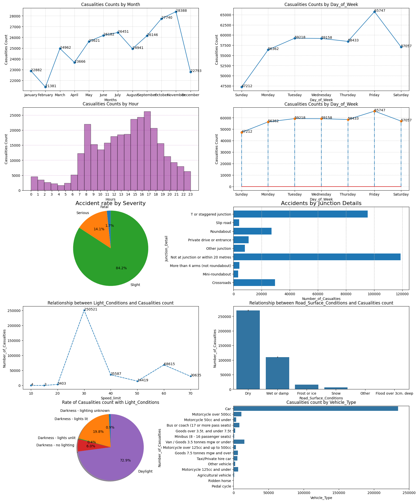

# 🚗 Road Accident Data Analysis using Python

## 📘 **Overview**

This project focuses on analyzing **Road Accident Data** to uncover insights about when, where, and why accidents occur.
Through detailed **data cleaning, feature engineering, and visualization**, the goal is to identify key factors influencing accident trends and severity.

---

## 🎯 **Objective**

To perform **Exploratory Data Analysis (EDA)** on road accident data and derive **meaningful insights** that can help improve road safety and traffic management decisions.

---

## 🧰 **Tools & Technologies Used**

* 🐍 **Python**
* 🧮 **Pandas** – Data cleaning & manipulation
* 📊 **NumPy** – Numerical computation
* 📈 **Matplotlib & Seaborn** – Data visualization & trend analysis

---

## 🧹 **Data Cleaning & Preprocessing**

* Removed **missing and duplicate values**
* Converted **date & time columns** to proper datetime format
* Extracted **Month, Day, and Hour** for time-based analysis
* Encoded categorical features where needed

---

## 🔍 **Exploratory Data Analysis (EDA)**

### 📆 **Time-Based Analysis**

* **November** had the **highest number of accidents**
* **Fridays** recorded the most incidents
* **Peak hours:** Between **3 PM and 6 PM**

### 🌦️ **Weather & Road Conditions**

* Most accidents occurred under **clear and dry conditions**
* Fewer incidents in foggy or snowy weather

### 🏙️ **Area & Road Type**

* Majority of accidents occurred on **urban roads**
* Rural areas recorded fewer incidents comparatively

### 🚗 **Vehicle Type & Severity**

* **Cars** were involved in most accidents
* Around **84%** of total cases were of **slight severity**
* Only a small portion were **serious or fatal**

---

## 💡 **Key Insights**

1. **Evening hours (3 PM – 6 PM)** are the most accident-prone.
2. **Fridays and weekends** see higher accident rates.
3. **Urban areas** are more affected due to heavy traffic.
4. **Dry roads and clear weather** show more accidents, possibly due to higher speed and overconfidence.
5. **Cars** dominate accident data, highlighting the need for better urban driving awareness.

---

## 📊 **Visualization Examples**

* Monthly accident trend line chart
* Day-wise accident count heatmap
* Accident severity distribution
* Hourly accident frequency bar graph
* Road type vs. weather condition analysis

---

## 📸 Dashboard Preview

---

## 🧾 **Project Workflow**

1. Data Import
2. Data Cleaning & Feature Engineering
3. EDA and Visualization
4. Insights Summary

---

## 🧠 **Learnings**

* Data preprocessing and feature extraction techniques
* Finding correlations between time, weather, and severity
* Storytelling using visualizations
* Translating data into actionable insights

---

## 🔗 **Future Improvements**

* Implement predictive modeling (e.g., accident severity prediction)
* Dashboard visualization using **Plotly or Power BI**
* Integration with real-time traffic datasets

---

## 🔗 **Connect with Me**

👤 **Loganathan R**

